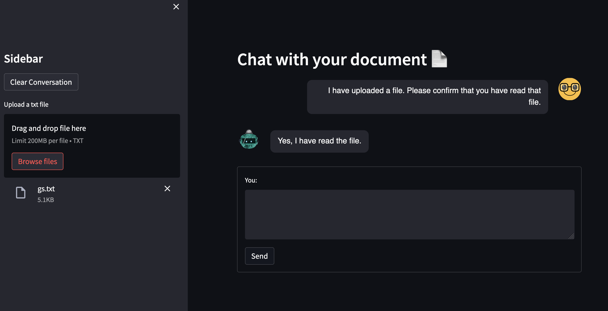
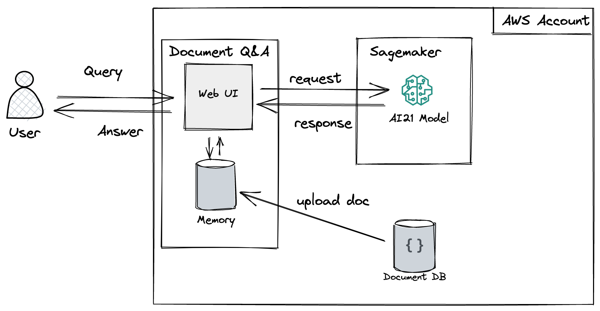

# document_chatbot
A repository for a document chatbot

## Architecture diagram for SageMaker implementation
The key advantage with this implementation is that no data ever leaves your AWS account. The model is hosted in a SageMaker endpoint in your account and all inference requests will be sent to that endpoint.

## How to run the application with a SageMaker Endpoint
1. Go to the [SageMaker folder](src/sagemaker)
2. Install the required packages for this application with `pip install -r requirements.txt`
3. You will need a SageMaker endpoint deployed in your account. If you don't have one you can use this [notebook](src/sagemaker/deploy_ai21_model.ipynb) to deploy the AI21 Jurassic-2 Jumbo Instruct model in your account (Caution: This will spin up an ml.p4d.24xlarge instance in your account to host the model, which costs ~$30 per hour!). Alternatively you can deploy a different, smaller model into a SageMaker endpoint.
4. Amend the [app.py](src/sagemaker/app.py) file so that it points to your endpoint (variable `endpoint_name`) and that it loads your AWS credentials correctly (i.e. set `credentials_profile_name` when calling the `SagemakerEndpoint` class)
5. Run the app with `streamlit run app.py`
6. Upload a text file
7. Start chatting 🤗